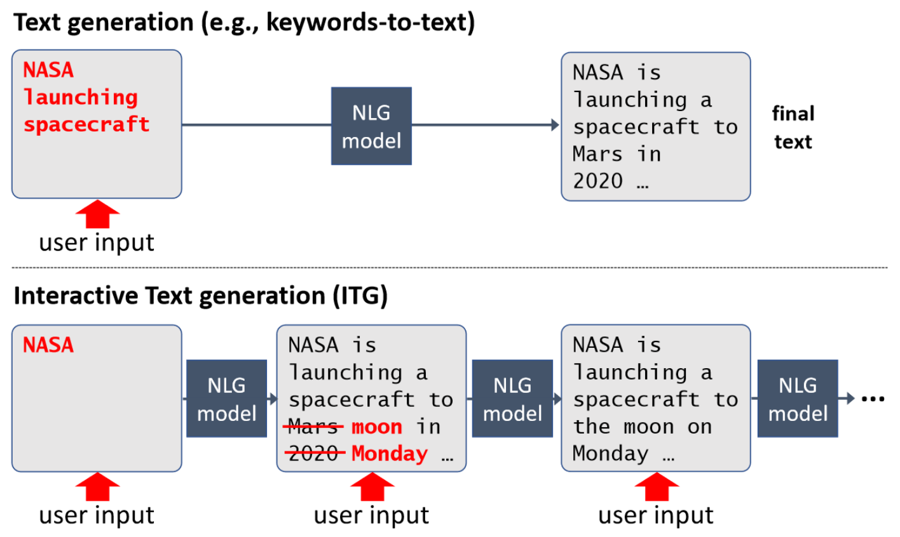

# Overview

This project offers an implementation of the paper:

**Interactive Text Generation**\
Felix Faltings, Michel Galley, Baolin Peng, Kianté Brantley, Weixin Cai, Yizhe Zhang, Jianfeng Gao, Bill Dolan\
[arXiv](https://arxiv.org/abs/2303.00908)

# Installation

Install dependencies using requirements.txt (with pip) or environment.yaml (with conda). Then, install the package. From the top level directory (where `setup.py` is located), run:
`pip install -e .`
This will install this package as an editable module named `infosol`.

Download model files [here](https://1drv.ms/u/s!AshEqwB44aR6n5JmyZ-8XvvYZ56xTw?e=iV2YCh).

# DATA

You can regenerate the data used in the paper using the `make_data.py` script. You only need to specify the `data_dir` argument where the data will be saved (under `data_dir/cnn_bart`). This script first downloads the raw data from the Huggingface hub.

# Test

To replicate the main experiments of the paper, run:

scripts/make_eval_jobs.py

The above command creates jobs files in 'jobs' directory, as well as the directory structure ('out') where test results will be stored. Then, you can pass any of the configuration files under 'jobs' as argument to scripts/run_eval.py. For example, run the following to replicate the S2S 'interactive' experiments (Table 4 of the paper):

python scripts/run_eval.py --args_path jobs/interactive/cnn-bart-s2s --cuda_device 0

Note: The S2S experiments of the paper yield generation that were inconsisent in length and hurt S2S performance. Thus, we tuned its length_penalty hyperparameter on a held out set, and the corresponding job files can be found in jobs/s2s.txt.

# Train

In order to train all the models presented in the paper, you may use the provided Makefile. Set the `run_dir` variable to the directory where you would like model weights to be saved to. You also need to set the `DATA_DIR` and `SAVE_DIR` paths in `train.py`.

# Code walkthrough

We suggest you go through the code in the order alignment -> model -> train/evaluate. Alignment defines some basic objects like alignments (used heavily by the oracle) and canvases (the objects that the model and oracle operate on). The others are self-explanatory and are commented.

The main files:
- alignment.py
- env.py
- evaluate.py
- models/word_edit_model.py
- run_eval.py
- train.py
- (decoding.py)

## Contributing

This project welcomes contributions and suggestions.  Most contributions require you to agree to a
Contributor License Agreement (CLA) declaring that you have the right to, and actually do, grant us
the rights to use your contribution. For details, visit https://cla.opensource.microsoft.com.

When you submit a pull request, a CLA bot will automatically determine whether you need to provide
a CLA and decorate the PR appropriately (e.g., status check, comment). Simply follow the instructions
provided by the bot. You will only need to do this once across all repos using our CLA.

This project has adopted the [Microsoft Open Source Code of Conduct](https://opensource.microsoft.com/codeofconduct/).
For more information see the [Code of Conduct FAQ](https://opensource.microsoft.com/codeofconduct/faq/) or
contact [opencode@microsoft.com](mailto:opencode@microsoft.com) with any additional questions or comments.

## Trademarks

This project may contain trademarks or logos for projects, products, or services. Authorized use of Microsoft 
trademarks or logos is subject to and must follow 
[Microsoft's Trademark & Brand Guidelines](https://www.microsoft.com/en-us/legal/intellectualproperty/trademarks/usage/general).
Use of Microsoft trademarks or logos in modified versions of this project must not cause confusion or imply Microsoft sponsorship.
Any use of third-party trademarks or logos are subject to those third-party's policies.
